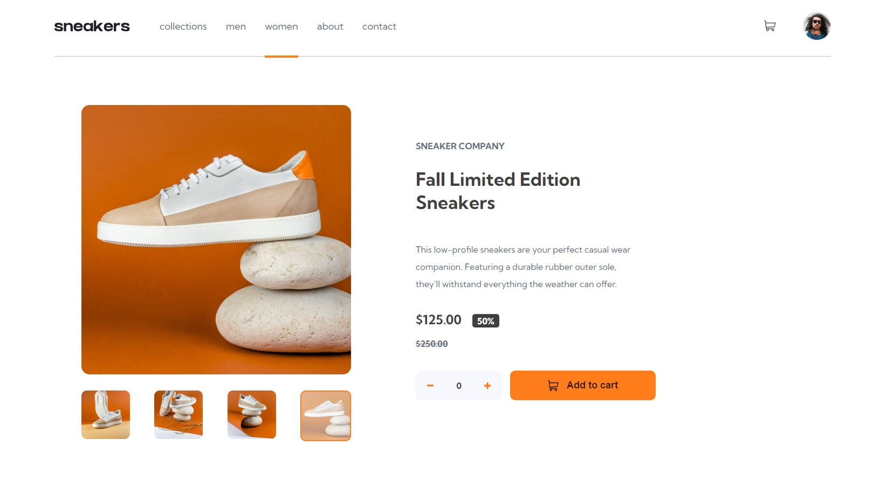
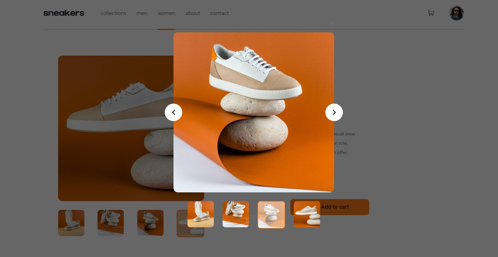

# Frontend Mentor - E-commerce product page solution

## Table of contents

- [Overview](#overview)
  - [The challenge](#the-challenge)
  - [Screenshot](#screenshot)
  - [Links](#links)
- [My process](#my-process)
  - [Built with](#built-with)
  - [What I learned](#what-i-learned)
  - [Install and usage](#install-and-usage)
- [Author](#author)

## Overview

### The challenge

Users should be able to:

- View the optimal layout for the site depending on their device's screen size
- See hover states for all interactive elements on the page
- Open a lightbox gallery by clicking on the large product image
- Switch the large product image by clicking on the small thumbnail images
- Add items to the cart
- View the cart and remove items from it

### Screenshot

### Links

- Solution URL: [Github](https://github.com/VitaliySaburdo/ecommerce-product-page)
- Live Site URL: [Vercel](https://ecommerce-product-page-seven-azure.vercel.app/)

## My process

### Built with

- Semantic HTML5 markup
- CSS custom properties
- Flexbox
- CSS Grid
- SASS
- Mobile-first workflow
- [Typescript](https://www.typescriptlang.org/) - strongly typed programming language that builds on JavaScript
- [React](https://reactjs.org/) - JS library

### What I learned

How to import as a component using vite-plugin-svgr and then apply custom styles to it.

### Install and usage

Clone this repository to your local machine using git clone https://github.com/VitaliySaburdo/ecommerce-product-page
Run npm install to install the dependencies.
Run npm run dev to start the development server.
Open http://localhost:3000 in your web browser.

## Author

- Website - [Vitaliy Saburdo](https://github.com/VitaliySaburdo)
- Frontend Mentor - [@VitaliySaburdo](https://www.frontendmentor.io/profile/VitaliySaburdo)
